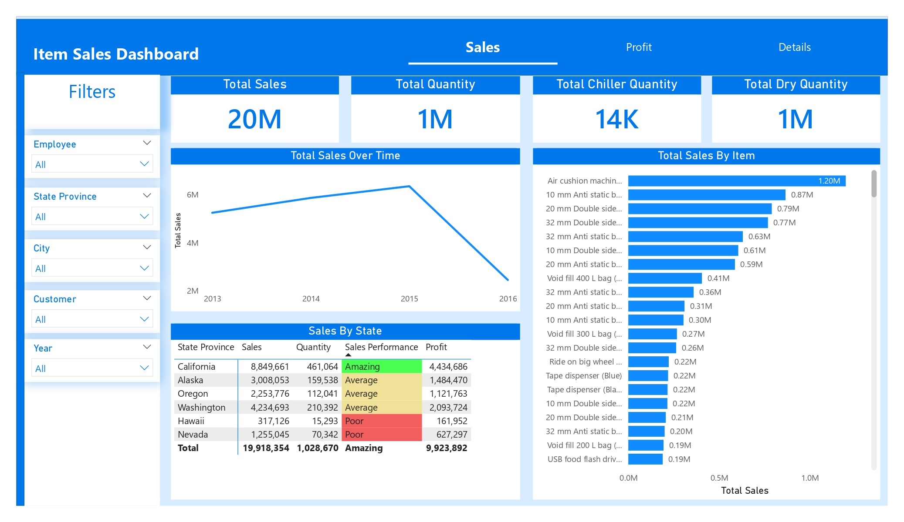
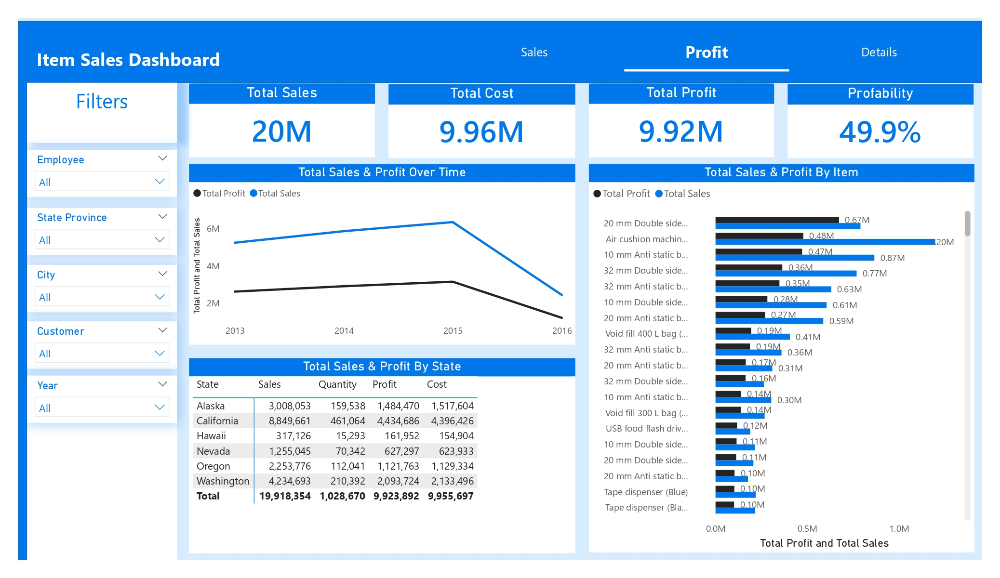
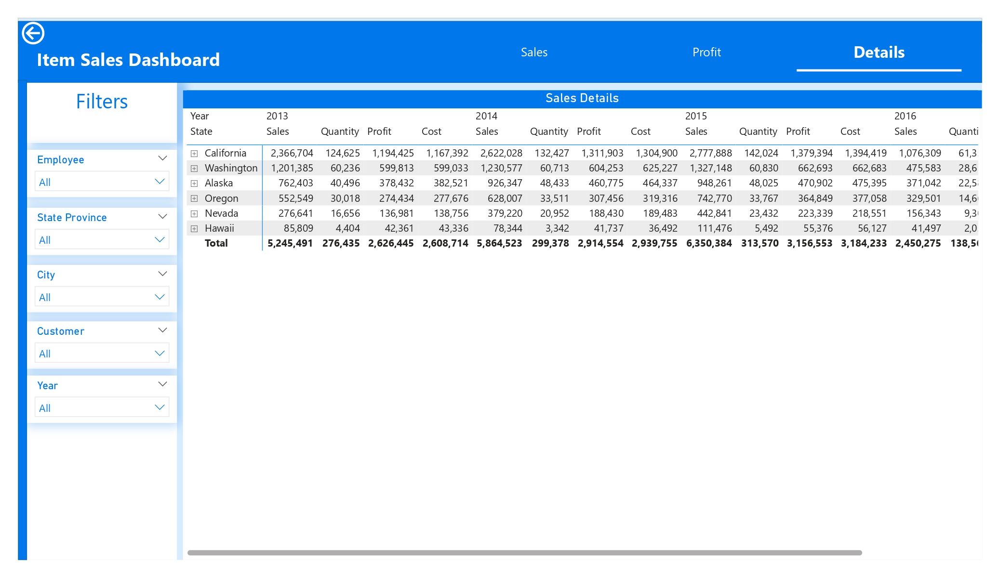

# WWI Item Sales Dashboard

## Project Overview
A dynamic and interactive Power BI dashboard designed to analyze sales performance, profitability, and operational efficiency across multiple dimensions.

This project transforms raw transactional data into actionable business insights, helping stakeholders understand trends, identify opportunities, and make data-driven decisions.

## Business Objectives
Monitor overall sales performance
Analyze profitability and cost efficiency
Identify top-performing products and regions
Track sales trends over time
Enable interactive exploration using filters

### Key Metrics (KPIs) 📌 
Metric	Value,
Total Sales	20M+,
Total Profit	9.92M,
Total Cost	9.96M,
Profitability	49.9%,
Total Quantity Sold	1M+

## Dashboard Pages 📊 :
## Sales Analysis
Provides a high-level overview of sales performance.

### Highlights:

Total Sales & Quantity
Sales distribution (Chiller vs Dry products)
Sales trend over time (2013–2016)
Top-selling items ranking
State-level performance classification:
High (Amazing)
Medium (Average)
Low (Poor)
## Profit Analysis

Focuses on financial performance and efficiency.

### Highlights:

Sales vs Cost vs Profit comparison
Profit margin analysis (~50%)
Sales & Profit trend over time
Product-level profitability comparison
State-level financial breakdown
## Detailed Analysis

Deep dive into granular data.

### Highlights:

Yearly breakdown (2013–2016)
Drill-down by state
Metrics included:
Sales
Quantity
Cost
Profit
Aggregated totals for validation
🎛️ Interactive Filters

The dashboard includes dynamic filters to enhance analysis:

Employee
State / Province
City
Customer
Year

These filters allow users to slice and dice data in real time.

### Insights & Findings 📈
Sales peaked in 2015, followed by a sharp decline in 2016
California is the top-performing state in both sales and profit
Some high-selling products generate lower profit margins
Business maintains a strong profitability ratio (~50%)
Sales distribution is concentrated among a few key products

### Tech Stack 🛠️
Power BI → Data Visualization
DAX → Calculations & Measures
Power Query → Data Cleaning & Transformation
Data Modeling → Relationships & Schema Design

### Project Structure📂
├── dataset/              # Raw data files
├── dashboard.pbix       # Power BI file
├── images/         # Dashboard images
└── README.md            # Documentation

### Future Enhancements
Sales forecasting (Time Series Analysis)
Customer segmentation
KPI alerts & anomaly detection
Deployment on Power BI Service
Real-time data integration
